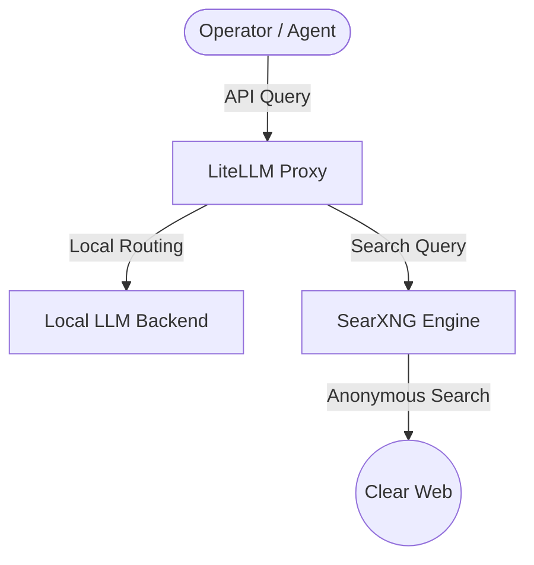

# Building a Private AI Research Lab: Bridging LiteLLM and SearXNG on NextGenPVE

If you are running offensive research, intelligence gathering, or vulnerability analysis, public AI endpoints are a massive liability. Every query, CVE lookup, or payload analysis you send to a public API leaks telemetry. It exposes your research pipeline to external telemetry logging. To solve this, we stood up a fully localized, secure AI research stack running inside a private sandbox on our virtualization infrastructure.

Here is a breakdown of what we built on **NextGenPVE**, how we bridged local LLMs with a private search harvester, and where we are taking this automated target research pipeline.

---

## The Infrastructure Stack

The entire stack is containerized and orchestrated via Docker Compose inside **LXC 205**. The deployment is split into three core layers:

* **SearXNG (Private Metasearch):** A privacy-respecting, self-hosted search engine. It acts as our automated agent's eyes and ears on the web, aggregating results from Google, Bing, and DuckDuckGo without exposing our source IP, user-agents, or search queries to trackers.
* **LiteLLM (API Gateway):** A lightweight, centralized proxy that exposes a unified, OpenAI-compatible API endpoint. Under the hood, it handles routing, fallback mechanisms, model alias translation, and token security.
* **Custom Agent Core:** Our Discord assistant, Skully-Bot, which interfaces directly with the LiteLLM gateway to coordinate tasks.

---

## Local AI Orchestration via LiteLLM

Using different LLMs for different tasks is standard practice. You might want a fast, abliterated 3B model for quick triaging, a medium Llama variant for code parsing, and a heavy abliterated model for payload synthesis. 

Managing separate API connections, model formats, and backend credentials for each engine inside your application code is messy. LiteLLM solves this by acting as a routing layer.

In our configuration, the gateway exposes generic model aliases to our agents:
* `skully-brain-v1`
* `skully-brain-medium`
* `skully-brain-heavy`

When an agent requests a completion from `skully-brain-heavy`, LiteLLM translates the request, appends the necessary auth keys (using `sk-gateway-master-key` placeholders), and forwards it to the correct backend endpoint (such as our local Ollama instance running abliterated weights). If a local GPU node goes offline, the proxy handles the fallback logic gracefully, ensuring the agent remains operational without code changes.

---

## Bridging LLMs and SearXNG: The Intelligence Loop

Having a private LLM is useful, but its knowledge is frozen at its training cutoff. Connecting it to the live web makes it powerful. By bridging LiteLLM and SearXNG, we create an automated target research loop that respects privacy:

1. **Summon & Query:** The operator asks the agent to investigate a newly published zero-day or look up a specific threat actor campaign.
2. **Anonymous Scrape:** The agent queries SearXNG. The search aggregator scrapes the web anonymously, stripping tracking cookies, and returns the raw search result JSON payload.
3. **HTML Processing:** The agent downloads the target webpage HTML, filters out script tags and styling, and extracts the core textual telemetry.
4. **Local Analysis:** The parsed text is sent back to LiteLLM, where the local abliterated LLM analyzes the data, maps it to the MITRE ATT&CK framework, and extracts Indicators of Compromise (IoCs).

This entire process occurs within our local network boundaries. No search parameters, target URLs, or extracted malware indicators are ever exposed to public commercial API providers.

---

## What's Next

With the local AI gateway and private search engine fully online and autostarting on boot, our next step is to integrate threat emulation modules directly into this loop. By combining local code execution environments with a private intelligence harvester, we can automate target profiling, payload generation, and YARA signature validation in a completely isolated environment.
