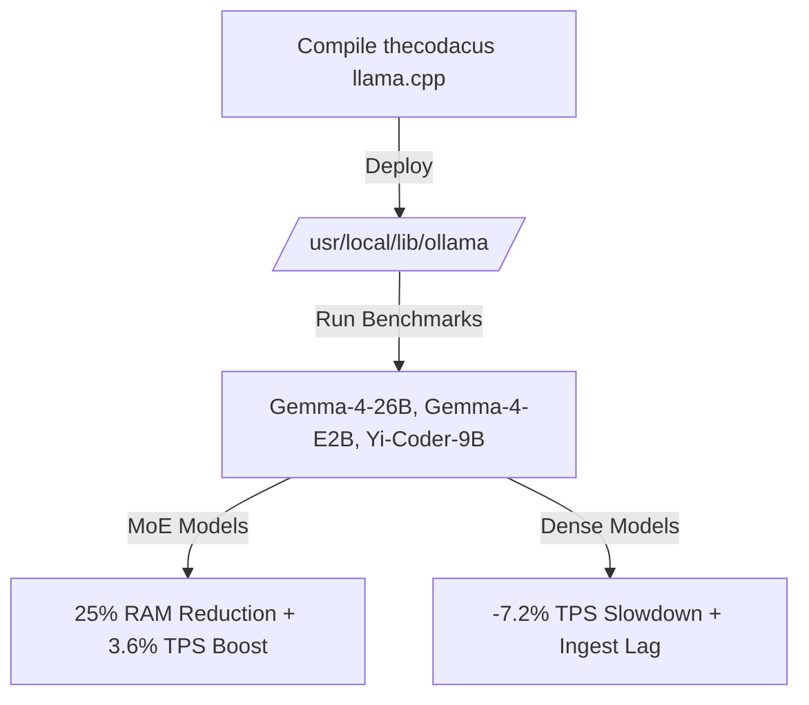

# Experimental Rebuild Tuning: llama.cpp MoE Memory Gains and Dense Regressions

When you are running a local red-team intelligence rig, VRAM is the ultimate bottleneck. Standard dense models demand a massive footprint, and trying to run larger architectures on a single workstation class GPU (like our RTX A2000 with 12GB VRAM) usually leads to out-of-memory crashes or sluggish system spillover. 

To solve this, we recently compiled and tested the custom `thecodacus` fork of `llama.cpp` inside our Ollama environment on VM 101. This specific fork introduces custom memory mapping and optimized execution paths for Mixture of Experts (MoE) models. 

Here is what we discovered, the exact performance metrics we logged, and why we ultimately chose to roll back to the upstream main branch.

---

## Swapping the Engine: The Setup

The custom build was compiled from source and deployed directly to the Ollama path (`/usr/local/lib/ollama/`) on our Proxmox `blue-brain-RTX` node. 

We ran the setup through our standard V7 benchmark suite. The test consists of one complex coding prompt and four detailed offensive and defensive security scenarios. We locked the temperature to 0.0 to ensure deterministic output comparison.

---

## The Performance Boost: MoE Efficiency

First, the positive outcomes. The memory optimizations in this fork are highly effective for sparse architectures. 

Our main target was **Gemma-4-26B-Abliterated**, which is a heavy model to run on a 12GB card. Under this custom build, we saw a massive **25% reduction in peak RAM footprint**, dropping the VRAM overhead from 14.1% down to a comfortable 10.6%. Alongside the memory savings, generation speed ticked up by 3.6%, rising from 32.44 TPS to 33.62 TPS.

For the lightweight **Gemma-4-E2B**, the memory footprint dropped by 20% (falling to 10.0% peak RAM). If you are running multiple micro-agents on resource-constrained edge hardware, these memory savings are incredibly valuable.

---

## The Downside: Dense Model Slowdowns

The trade-off came when we tested standard dense models. Unlike MoE architectures, dense models allocate resources to all parameters for every single token. 

On this custom fork, our dense models experienced a noticeable generation speed regression:
* **Gemma-4-E2B-Abliterated:** Experienced a **7.2% generation slowdown** (dropping from 87.39 TPS down to 81.05 TPS).
* **Yi-Coder-9B-Chat:** Experienced a **4.7% generation slowdown** (dropping from 35.71 TPS down to 34.00 TPS).
* **Ingest Speed:** Prompt processing (ingest speed) was consistently slower across every model we tested.

---

## The Master Comparison: Custom Rebuild vs. Upstream Legacy

Here is the exact dataset we logged during the side-by-side run:

| Model | Ingest TPS (Before / After) | Gen TPS (Before / After) | Peak RAM (Before / After) | Accuracy / Prompts (Before / After) | Notes |
| :--- | :---: | :---: | :---: | :---: | :--- |
| **`Gemma-4-26B-Abliterated`** | 154.50 / **118.03** | 32.44 / **33.62** | 14.1% / **10.6%** | **4/5** / **2/5** | MoE model. **+3.6% Gen speedup**, **25% VRAM drop**. Fumbled accuracy. |
| **`Gemma-4-E2B-Abliterated`** | 2384.09 / **1858.95** | 87.39 / **81.05** | 12.5% / **10.0%** | **5/5** / **5/5** | Edge model. **20% VRAM drop**, -7.2% generation speed cost. |
| **`Yi-Coder-9B-Chat`** | 1112.79 / **1068.08** | 35.71 / **34.00** | 13.2% / **12.7%** | **5/5** / **5/5** | Dense model. Minor VRAM drop, -4.7% generation speed cost. |

---

## The Dealbreaker: Fumbled Accuracy

A minor slowdown on dense models is something we could live with if the memory savings were necessary. The real problem was factual accuracy.

Under this custom build, **Gemma-4-26B-Abliterated fumbled multiple security prompts** it had previously passed without issue. It failed prompts evaluating privilege escalation vectors and SSH pivoting logic, resolving only 2 out of the 5 test scenarios.

This accuracy collapse points to a critical bug in how this fork's MoE attention path maps context representation. If the attention math is slightly corrupted, the model starts hallucinating exploitation commands and fumbling logic gates. 

---

## The Verdict: Reverting to Upstream Main

When you are running autonomous agent loops, reliability is everything. A model that runs 25% lighter but regularly fumbles its reasoning is a liability in a production security environment. 

We rolled VM 101 back to the official upstream main branch of `llama.cpp`. We will continue to track the memory optimization PRs in the main repository, but for now, raw dense performance and factual accuracy are non-negotiable.
