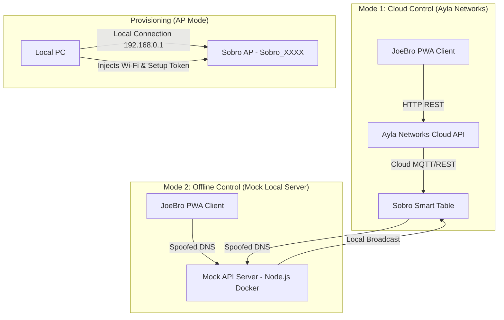

# JoeBro & Sobro IoT Rescue Stack

```
      _            ____             
     | | ___   ___| __ ) _ __ ___   
  _  | |/ _ \ / _ \  _ \| '__/ _ \  
 | |_| | (_) |  __/ |_) | | | (_) | 
  \___/ \___/ \___|____/|_|  \___/  
```

**A Unified Open-Source Framework to Fix the Sobro App Crash and Reclaim Your Sobro Smart Coffee Table**

If your **official Sobro App** keeps crashing, failing to open, or is completely broken on modern iOS or Android devices, you are not alone. StoreBound has abandoned the official app, turning an expensive **Sobro Smart Table** into a disconnected brick. 

This repository contains the **JoeBro IoT Rescue Stack**—a comprehensive solution to restore full functionality to your **Sobro Smart Coffee Table**. By reverse-engineering the Ayla Networks cloud API, this project bypasses the crashing official app, enabling you to control your table through a lightweight Progressive Web App (PWA) or migrate to a fully offline local server.

Read the full reverse-engineering and recovery guide on the [NextGenRedTeam Blog: Rescuing Abandoned IoT (JoeBro Sobro Table Rescue)](https://nextgenredteam.com/blog/rescuing-abandoned-iot-joebro-sobro.html).

---

## 📸 JoeBro PWA Controller Preview


---

## ⚡ System Architecture



---

## 📂 Repository Structure

- `tools/joebro/` - The core **JoeBro Web Controller** (standalone PWA: HTML5, CSS, vanilla JS)
  - [index.html](file:///f:/OneDrive/SoBroExploit/tools/joebro/index.html) - Dashboard interface
  - [app.js](file:///f:/OneDrive/SoBroExploit/tools/joebro/app.js) - Client API handling and register packing
  - [style.css](file:///f:/OneDrive/SoBroExploit/tools/joebro/style.css) - Responsive styling
  - [provision.ps1](file:///f:/OneDrive/SoBroExploit/tools/joebro/provision.ps1) - Automated 2-step setup script (Windows)
  - [provision.sh](file:///f:/OneDrive/SoBroExploit/tools/joebro/provision.sh) - Step 1 provisioning script (Mac/Linux)
- `mock-api/` - Docker-based local server infrastructure to replace Ayla Cloud for offline control
  - [Dockerfile](file:///f:/OneDrive/SoBroExploit/mock-api/Dockerfile) - Self-contained server and PWA build definition
  - [server.js](file:///f:/OneDrive/SoBroExploit/mock-api/server.js) - Mock Express.js API matching real Ayla endpoints
  - [docker-compose.yml](file:///f:/OneDrive/SoBroExploit/mock-api/docker-compose.yml) - Local Pi-hole and Node API stack
- `AylaConnector.ps1` - Helper script to push Wi-Fi credentials to the table
- `AylaDumper.ps1` - Diagnostic script to dump device status from the table's AP mode
- `REGISTER_TABLE.md` - Technical walkthrough of table registration and API sniffing
- `deploy_guide.md` - Deployment instructions for Cloudflare Pages or GitHub Pages

---

## ⚡ Project & PWA Features

- **Zero Backend Required**: Operates 100% in your browser. No Docker, no Python, no local servers required for cloud control.
- **Real-Time Responsiveness**: Employs a custom API throttler to safely allow real-time color and brightness dragging without hitting API rate limits.
- **Mobile First Design**: Built with responsive CSS, touch-action protections, and PWA capabilities for a native mobile experience.
- **Hidden Features Unlocked**: Access to undocumented capabilities like forcing Bluetooth speaker pairing mode and fine-tuning backlight brightness.

---

## ⚠️ Wi-Fi Chip Network Constraints (CRITICAL)

The internal Wi-Fi microcontroller on the Sobro table is legacy hardware and has strict network constraints. **Failing to meet these constraints will cause the Wi-Fi chip to crash, fail to connect, or continuously reset back into AP mode:**

1. **2.4 GHz Band Only:** The table does not support 5 GHz networks. Ensure your Wi-Fi router broadcasts a dedicated 2.4 GHz SSID.
2. **WPA2-Personal (AES) Security Only:** You **MUST** use WPA2-Personal (AES) security. **Do not use WPA3 or WPA2/WPA3 Mixed mode.** If the table detects a WPA3 transition element in the beacon, the chip will fail, crash, and revert to AP hotspot mode.

---

## 🚀 Step-by-Step Provisioning Guide

If you change your Wi-Fi credentials or get a new table, you must provision it to your network. Because the official app is broken, use the following procedure:

> [!WARNING]
> **Host OS Execution Required:** You MUST run these provisioning scripts directly on your host computer (Windows/Mac/Linux), NOT inside Docker. Docker containers cannot access your host's physical Wi-Fi network card to join the table's hotspot.
>
> **Temporary Internet Disconnection:** Connecting to the table's Wi-Fi hotspot will temporarily disconnect your computer from your home Wi-Fi and the internet. All internet requests will fail during this period. The scripts are built to handle this seamlessly by pausing when Wi-Fi needs to be switched back.

### 1. Enter AP Mode
- Press and hold the physical power button on the back/underside of the Sobro table until the table beeps and the front sensor lights flash.
- The table will now broadcast an unsecured Wi-Fi hotspot named **`Sobro_XXXX`** (where `XXXX` represents part of the MAC address).

### 2. Connect Your Computer
- Open your computer's Wi-Fi menu and connect directly to the **`Sobro_XXXX`** network. (It is unsecured, so no password is required).

### 3. Run the Provisioning Script
Navigate to the repository folder and run the provisioning script on your host system:

#### Windows PowerShell:
```powershell
.\tools\joebro\provision.ps1
```
* **One-Shot Handshake Flow:** The script will ask for your home Wi-Fi and Ayla credentials. 
* **Step 1 (Offline):** It will push the Wi-Fi credentials to the table. The table will beep, shutdown its hotspot, and connect to your home network.
* **Pause (Re-connect):** The script will pause and prompt you: *"Please connect your computer BACK to your home Wi-Fi network ($ssid) so we can reach the Internet."*
* **Step 2 (Online):** Once you connect your PC back to home Wi-Fi (restoring internet access) and press Enter, the script automatically resumes, authenticates with Ayla Cloud, and binds the table to your account.

#### Mac / Linux Bash:
```bash
chmod +x ./tools/joebro/provision.sh
./tools/joebro/provision.sh
```
* **Step 1 (Offline):** The bash script injects your home Wi-Fi credentials into the table. Once it completes and the table beeps, you must manually reconnect your computer back to your home Wi-Fi, open the JoeBro Web Controller in your browser, and bind the table (Step 2) via the dashboard UI.

#### Fallback Manual Injection (Web Browser):
If scripts are blocked, you can send the parameters manually:
1. While connected to `Sobro_XXXX`, get the registration token:
   ```
   http://192.168.0.1/regtoken.json
   ```
   Save the 8-digit `"regtoken"` returned in the JSON. If it fails, generate a random 8-digit number (e.g. `87654321`) to use as your fallback `setup_token`.
2. Push your Wi-Fi credentials to the table:
   ```
   http://192.168.0.1/wifi_connect.json?ssid=YOUR_HOME_SSID&key=YOUR_HOME_PASSWORD&setup_token=YOUR_TOKEN
   ```
3. The table will beep and reboot to join your network.
4. Reconnect your computer to your home Wi-Fi to restore internet, open the JoeBro UI, and bind the token.

---

## 🔒 Ayla Cloud Account Binding (Step 2)

Once the table has rebooted and joined your home Wi-Fi network, reconnect your computer to your home Wi-Fi network to gain internet access.

### Method A: JoeBro Controller UI (Easiest)
1. Open `tools/joebro/index.html` in your web browser.
2. Sign in with your Ayla Cloud credentials (or bypass token).
3. On the top right of the dashboard, click **➕ Bind Table**.
4. Paste the `regtoken` or fallback `setup_token` you captured during provisioning and click **Register Device**.

### Method B: Manual API Curl Request
If you want to bind the table directly using command-line tools:
```bash
curl -X POST \
  -H "Authorization: auth_token YOUR_AYLA_SESSION_TOKEN" \
  -H "Content-Type: application/json" \
  -d '{"device": {"regtoken": "YOUR_CAPTURED_REGTOKEN"}}' \
  "https://ads-field.aylanetworks.com/apiv1/devices.json"
```

---

## 🕵️ Bypassing Login via Cloud Auth Token Sniffing & API Tricks

If you do not want to enter your email and password directly into the JoeBro PWA interface, or if your Ayla/Sobro account uses Facebook Login, you can use these alternative login tricks. The JoeBro PWA also provides a built-in step-by-step **Help Guide** directly on the login overlay.

### Method 1: Facebook Redirect URL Trick (OAuth Bypass)
Because the custom client runs under different domains or local filesystems, browser cross-origin limits prevent the client from reading Facebook's callback URL.
1. Click **Login with Facebook** in the JoeBro login overlay.
2. A new browser tab opens to Facebook's authentication page. Complete your login.
3. The page will redirect to an Ayla web landing page containing the OAuth code (e.g. starting with `https://mobile.aylanetworks.com/?code=...`).
4. Copy the entire URL from the browser's address bar.
5. Paste it into the Facebook Redirect URL input in JoeBro and click **Complete Login**.

### Method 2: Generate Token via API Command Line (CLI Trick)
You can retrieve your Ayla access token by querying their auth API directly from your computer's terminal:

#### PowerShell (Windows):
```powershell
$body = @{ user = @{ email = 'YOUR_EMAIL'; password = 'YOUR_PASSWORD'; application = @{ app_id = 'sobro-ag-id'; app_secret = 'sobro-mDM8M4JEe7IJFwiKvbs956XqX_s' } } }
$res = Invoke-RestMethod -Uri "https://user-field.aylanetworks.com/users/sign_in.json" -Method Post -Body ($body | ConvertTo-Json) -ContentType "application/json"
$res.access_token
```

#### curl (macOS / Linux / WSL):
```bash
curl -X POST -H "Content-Type: application/json" -d '{"user":{"email":"YOUR_EMAIL","password":"YOUR_PASSWORD","application":{"app_id":"sobro-ag-id","app_secret":"sobro-mDM8M4JEe7IJFwiKvbs956XqX_s"}}}' https://user-field.aylanetworks.com/users/sign_in.json | grep -o '"access_token":"[^"]*' | grep -o '[^"]*$'
```
*Run the command, copy the output token, click **Use Existing Auth Token** in the JoeBro PWA, paste it, and authenticate.*

### Method 3: Browser Developer Tools (No Tools Required)
1. Log in to Ayla's official platform (dashboard or user portal) in your web browser.
2. Press `F12` (or right-click -> **Inspect**) and navigate to the **Network** tab.
3. Reload the page or navigate to trigger API traffic.
4. Search/filter the requests list for `aylanetworks` or `devices.json`.
5. Select a request, inspect **Request Headers**, and find:
   `Authorization: auth_token MC1_...`
6. Copy the token string following `auth_token ` and use it in JoeBro's token login.

### Method 4: Intercepting App Traffic (HTTP Toolkit)
1. Run [HTTP Toolkit](https://httptoolkit.com/) on your computer.
2. Route your smartphone's Wi-Fi traffic through your computer's IP address on port `8000`. Install the HTTP Toolkit CA SSL Certificate on your phone.
3. Open the official **Sobro** app on your phone.
4. Filter HTTP Toolkit requests for `aylanetworks.com`.
5. Open any request to `https://ads-field.aylanetworks.com/apiv1/devices.json` and inspect the headers.
6. Copy the token string following `Authorization: auth_token ` (e.g., `MC1_8f0e0d0c...`) and paste it into the PWA.

---

## 📊 Ayla Cloud API Architecture

To bypass the broken mobile app, the JoeBro PWA communicates directly with the Ayla Cloud using the following REST endpoints:

1. **Authentication:**
   - `POST https://user-field.aylanetworks.com/users/sign_in.json`
   - Payload: Email, Password, App ID, App Secret
   - Returns: A 12-hour `access_token` required for all subsequent calls.

2. **Device Discovery:**
   - `GET https://ads-field.aylanetworks.com/apiv1/devices.json`
   - Headers: `Authorization: auth_token <token>`
   - Returns: A list of hardware devices bound to the user's account, including their unique `dsn` (Device Serial Number).

3. **State Synchronization:**
   - `GET https://ads-field.aylanetworks.com/apiv1/dsns/<dsn>/properties.json`
   - Returns: A massive JSON array containing the current live state of every hardware component on the table.

4. **Command Execution:**
   - `POST https://ads-field.aylanetworks.com/apiv1/dsns/<dsn>/properties/<property_name>/datapoints.json`
   - Payload: `{"datapoint": {"value": <data>}}`
   - Pushes a new state value to the table. Returns `201 Created` on success.

---

## 📊 Reverse-Engineered Property Map (Ayla Registers)

The JoeBro app controls the table's hardware features by sending values to specific registers (properties) on Ayla's servers:

| Property Name | Data Type | Range / Format | Description |
| :--- | :--- | :--- | :--- |
| `Cooling_switch` | Boolean | `0` (Off) / `1` (On) | Mini-fridge compressor toggle. |
| `Drawer_lock` | Boolean | `0` (Unlocked) / `1` (Locked) | Electronic locking mechanism for drawers. |
| `F_key` | Boolean | `0` (Off) / `1` (On) | Front motion-sensor light strip toggle. |
| `B_key` | Boolean | `0` (Off) / `1` (On) | Back RGB LED accent lighting toggle. |
| `ble_switch` | Boolean | `0` (Off) / `1` (On) | Forces the Bluetooth speakers into pairing mode. |
| `brightness` | Integer | `0` to `100` | Accent backlight brightness percentage. |
| `flight_status` | String | `Mode:Brightness:Duration:Temperature` | Front motion light parameters (e.g., `5:100:30:4000` = Mode 5, 100% Brightness, 30s duration, 4000K warm white). |
| `mode_status` | Integer | 31-bit Packed Integer | Packs back RGB colors and modes using bitwise packing. |

### 🎨 RGB Color Packing Details (`mode_status`)
The Sobro hardware packs the RGB color values into a single 31-bit integer. The structure expects Green, Blue, and Red (in that order) left-aligned, followed by 7 trailing bits reserved for light mode scenes (set to zero for static colors).

#### Javascript packing code:
```javascript
// Function to pack RGB hex to Sobro mode_status integer
function packRgb(hexColor) {
    // hexColor format: "RRGGBB" (e.g., "00FFFF" for Cyan)
    const rBin = parseInt(hexColor.substring(0, 2), 16).toString(2).padStart(8, '0');
    const gBin = parseInt(hexColor.substring(2, 4), 16).toString(2).padStart(8, '0');
    const bBin = parseInt(hexColor.substring(4, 6), 16).toString(2).padStart(8, '0');
    
    // Sobro expects: Green(8 bits) + Blue(8 bits) + Red(8 bits) + Zeros(7 bits)
    const binaryStr = gBin + bBin + rBin + "0000000";
    return parseInt(binaryStr, 2);
}

// Function to unpack Sobro mode_status integer back to Hex
function unpackRgb(modeStatusInt) {
    const binStr = Number(modeStatusInt).toString(2).padStart(31, '0');
    
    const gHex = parseInt(binStr.substring(0, 8), 2).toString(16).padStart(2, '0');
    const bHex = parseInt(binStr.substring(8, 16), 2).toString(16).padStart(2, '0');
    const rHex = parseInt(binStr.substring(16, 24), 2).toString(16).padStart(2, '0');
    
    return `#${rHex}${gHex}${bHex}`;
}
```

---

## 🌐 Offline Future-Proofing: Local Mock API

If Ayla Networks ever shuts down their servers, the Sobro table will lose all cloud connectivity. To future-proof the table, the `mock-api` directory contains a Node.js server that replicates Ayla's APIs locally and automatically hosts the JoeBro Web Controller static PWA.

### How to Run:
1. Navigate to the `mock-api/` directory:
   ```bash
   cd mock-api
   ```
2. Build and start the DNS sinkhole (Pi-hole) and mock API server:
   ```bash
   docker-compose up --build -d
   ```
   *(The `--build` flag builds our custom Dockerfile, compiling the mock backend server and bundling the JoeBro static PWA files inside the container).*
3. Configure your local network router or DNS server (like Pi-hole) to redirect requests for Ayla's domains to your local Docker host IP:
   - `user-field.aylanetworks.com` -> `YOUR_DOCKER_HOST_IP`
   - `ads-field.aylanetworks.com` -> `YOUR_DOCKER_HOST_IP`
4. The local server will listen on HTTPS port `443` and fallback HTTP port `8080`, rendering the JoeBro PWA at `http://localhost:8080` (or `https://localhost` if you have local SSL certs).

---

## 🛠️ Deployment and Local Run

The JoeBro PWA is built as standard static files.

### Build and Run Locally
1. Install dependencies:
   ```bash
   npm install
   ```
2. Run the development web server:
   ```bash
   npm run dev
   ```

### Deploy to Cloudflare Pages (Recommended)
1. Push your repository to GitHub.
2. Log into the Cloudflare Dashboard and navigate to **Workers & Pages**.
3. Create a project, connect your GitHub repository, and select:
   - **Framework preset:** None (Static site)
   - **Build command:** (Leave empty / none)
   - **Build output directory:** `./`
4. Deploy! Cloudflare will host the controller securely for free.

---

## 📄 License

This project is licensed under the MIT License. Contributions to expand offline firmware capability are welcome.
