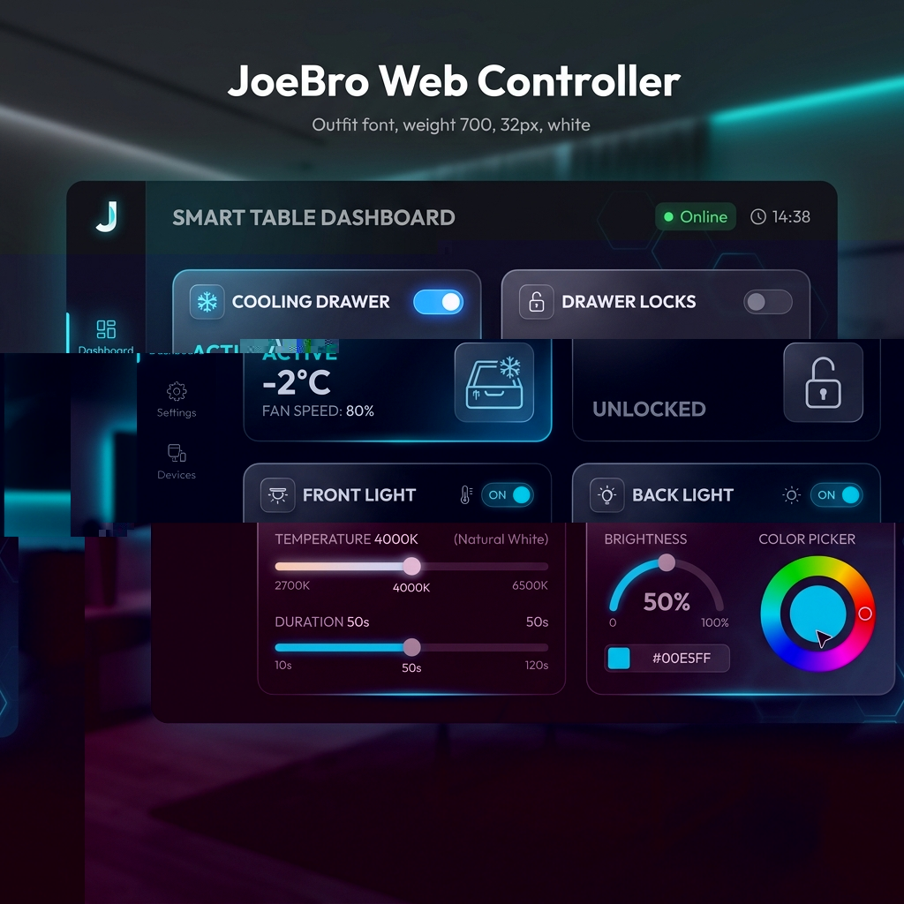

# JoeBro Web Controller (PWA) - Sobro Smart Table Client



## Why This Exists: Fixing the Broken Sobro App
If you own a **Sobro Smart Coffee Table** or a **Sobro Smart End Table**, you have likely experienced the frustration of the **broken Sobro app**. The manufacturer's official mobile application frequently suffers from a **Sobro App crash** or fails to open altogether on modern versions of Android and iOS. This **Sobro app crash** issue turns a premium, high-tech piece of furniture into an offline, uncontrollable brick. 

Because the table's local network communication requires AES encryption keys that are hidden inside the official mobile database, local integration is incredibly complex. 

**JoeBro Web Controller** was created to solve this. It is a completely open-source, client-side **Progressive Web App (PWA)** that bypasses the broken Sobro app entirely by communicating directly with the underlying **Ayla Networks Cloud API** used by the table. With this PWA, you can regain control of your smart table's fridge, locks, and lighting from any web browser on any device.

---

## Key Features
- **Zero Backend**: Runs 100% in your browser. No server setup, Docker container, or databases required.
- **PWA Compliance**: Features a Web App Manifest and Service Worker (`sw.js`) so it can be installed on your phone's home screen and run offline.
- **Undocumented Features**: Access capabilities not exposed in the official app, such as forcing Bluetooth pairing mode and fine-tuning backlight brightness.
- **Safe API Throttling**: Implements custom throttlers to handle live color-picking and brightness-dragging without getting rate-limited by the cloud API.

---

## Network Requirements
The Wi-Fi chip inside the Sobro table is old and highly sensitive. To ensure your table connects properly and doesn't trigger a crash loop, your network must meet these constraints:
1. **2.4 GHz Band Only**: The table does not support 5 GHz Wi-Fi networks. Ensure you have a dedicated 2.4 GHz SSID.
2. **WPA2-Personal Security**: Use WPA2-Personal (AES) encryption. **Do not use WPA3 or WPA2/WPA3 Mixed mode.** The security chip inside the table will crash and disconnect if WPA3 transition elements are present in the router's beacon.

---

## Initial Setup & Cloud Provisioning Guide
If you get a new table or change your Wi-Fi credentials, you cannot configure it using the official app due to the constant **Sobro App crash** problems. Use the provisioning scripts in this folder instead:

### Step 1: Put the Table into AP Mode
1. Ensure the table is plugged in.
2. Press and hold the physical power button on the back/underside of the table until the built-in lights start flashing.
3. Open your computer's Wi-Fi menu and connect to the unsecured network broadcasted by the table (usually named `Sobro_XXXX`).

### Step 2: Run the Setup Script
1. Clone this repository or download the files.
2. Open a terminal (PowerShell for Windows, Bash for macOS/Linux) in the `/tools/joebro/` directory.
3. Run the script:
   - **Windows (PowerShell)**:
     ```powershell
     .\provision.ps1
     ```
   - **Mac/Linux (Terminal)**:
     ```bash
     chmod +x provision.sh
     ./provision.sh
     ```

### Step 3: Complete the Handshake
1. The script will ask you for your home Wi-Fi SSID and password. It will push these credentials to the table via its local setup server. The table will reboot and join your home router.
2. The script will pause. Reconnect your computer back to your home Wi-Fi.
3. Press enter in the terminal. The script will prompt you for your Ayla Networks account email and password, log in, and register the table's DSN (Device Serial Number) to your account.
4. Once completed, your table is fully bound and ready to be controlled!

---

## How to Run the Web Controller
1. Open the [JoeBro Web Controller](https://nextgenredteam.com/tools/joebro/index.html) or host the `/tools/joebro/` directory on any web server.
2. Log in using the same Ayla account email and password you used in the provisioning step.
3. Select your discovered table and start controlling it!
4. **To Install as an App**: Click the install icon in your browser's address bar (Chrome/Edge) or select "Add to Home Screen" (Safari on iOS) to run it like a native app.

---

## Ayla Networks Cloud API Architecture
The PWA interacts with the Ayla Cloud using the following reverse-engineered REST endpoints:

- **Authentication**:
  - `POST https://user-field.aylanetworks.com/users/sign_in.json`
  - Body: Email, Password, App ID, App Secret
  - Returns: `access_token` (valid for 12 hours)

- **Device Discovery**:
  - `GET https://ads-field.aylanetworks.com/apiv1/devices.json`
  - Header: `Authorization: auth_token <token>`
  - Returns: Array of devices bound to your account and their unique `dsn`

- **State Sync**:
  - `GET https://ads-field.aylanetworks.com/apiv1/dsns/<dsn>/properties.json`
  - Returns: Full JSON array of hardware property states.

- **Command Delivery**:
  - `POST https://ads-field.aylanetworks.com/apiv1/dsns/<dsn>/properties/<property_name>/datapoints.json`
  - Payload: `{"datapoint": {"value": <data>}}`

---

## Reverse Engineered Datapoints
We control the table by sending updates to these specific Ayla property paths:
- `Cooling_switch` (Boolean): Fridge compressor toggle (`1` = On, `0` = Off).
- `Drawer_lock` (Boolean): Electronic drawer locks.
- `F_key` (Boolean): Front motion LED light toggle.
- `B_key` (Boolean): Back LED accent strip toggle.
- `ble_switch` (Boolean): Force Bluetooth pairing mode.
- `brightness` (Integer, 0-100): Brightness control for the back LED strip.
- `flight_status` (String): Controls the front light's configuration. Format: `Mode:Brightness:Duration:Temperature` (e.g. `5:100:50:4000` sets 50s duration, 4000K warm white).
- `mode_status` (Integer): Controls the RGB color of the backlights. The hex RGB color is packed into a 32-bit integer alongside the active scene mode using bitwise shifting.
